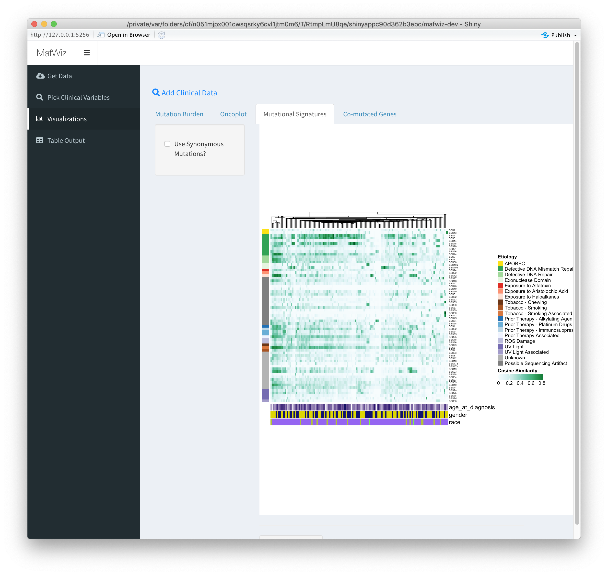

# MAF Wiz: A tool for visualizing MAF files
Maf Wiz *like math wiz*
 
## Shiny app for plotting data from MAF files
[Mutation Annotation Format (MAF)](https://docs.gdc.cancer.gov/Encyclopedia/pages/Mutation_Annotation_Format/) files are used for storing somatic mutation data across cohorts. For example, [The Cancer Genome Atlas (TCGA)](https://www.cancer.gov/about-nci/organization/ccg/research/structural-genomics/tcga) project has made MAF files from each project publicly available.  This app is intended to help allow quick summarization and visualization of these kind of data.
 
## How to run
### Install R and RStudio
Here's an [installation guide](http://www.sthda.com/english/wiki/installing-r-and-rstudio-easy-r-programming) if you don't have these already.

### Install Required Packages
```
list.of.packages <- c("shiny","shinyjs","openxlsx","shinycssloaders","shinyWidgets","shinythemes","RColorBrewer","ggplot2","reshape2","colourpicker")
new.packages <- list.of.packages[!(list.of.packages %in% installed.packages()[,"Package"])]
if(length(new.packages)) install.packages(new.packages)

list.of.bioc.packages <- c("maftools","ComplexHeatmap","circlize","dplyr","ggbeeswarm","TCGAbiolinks","NMF","MutationalPatterns","BSgenome.Hsapiens.UCSC.hg38","BSgenome.Hsapiens.UCSC.hg19")
if (!requireNamespace("BiocManager", quietly = TRUE))
    install.packages("BiocManager")
new.bioc.packages <- list.of.bioc.packages[!(list.of.bioc.packages %in% installed.packages()[,"Package"])]
if(length(new.bioc.packages)) BiocManager::install(new.bioc.packages)
```

### Run from GitHub in RStudio
```
library(shiny)
runGitHub( "mafwiz", "mtandon09", ref="dev")
```

# Example usage:
Upload your own MAF file or download TCGA MAFs on-the-fly
   
Add sample information for annotations
   
Visualizations
   - Mutational Burden
    
   - Oncoplot
    
   - Mutational Signatures (COSMIC v3)
    
   - Output data as table
    


# To Do
- Buncha stuff
